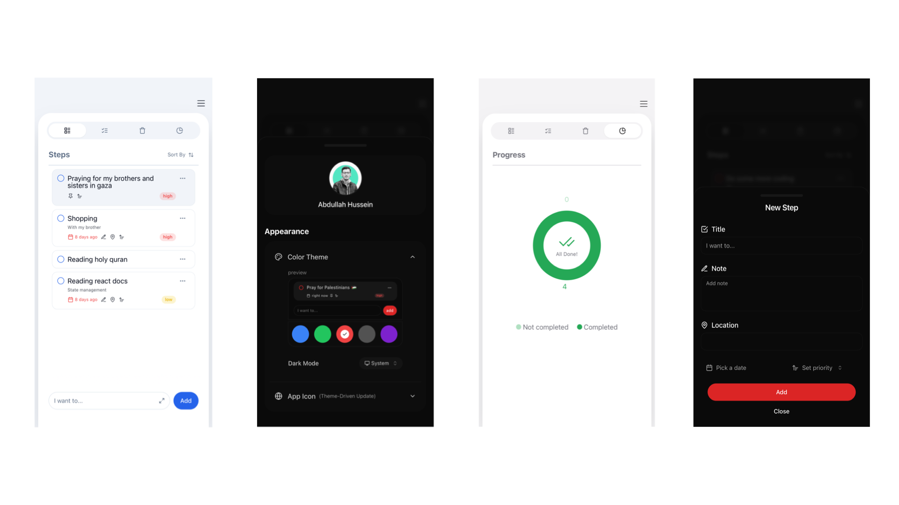

# Soft Steps - Your Tranquil Todo App

Welcome to Soft Steps, your simple and serene companion in conquering tasks effortlessly. Embrace the tranquility of productivity with our intuitive todo app designed to guide you through each step of your journey.



## Server

### Installation:

1. **Clone the repository:**
   ```bash
   git clone <repository_url>
   cd server
   ```

2. **Install dependencies:**
   ```bash
   npm install
   ```

3. **Create a `.env` file in the server directory and add your Supabase credentials:**
   ```env
   SUPABASE_URL=<your_supabase_url>
   SUPABASE_KEY=<your_supabase_key>
   PORT=<your_preferred_server_port>
   ```
   Replace `<your_supabase_url>` and `<your_supabase_key>` with your Supabase project URL and key.

4. **Build and start the server:**
   ```bash
   npm run start:dev
   ```
   This command will compile TypeScript, start the server using Nodemon for development, and listen for changes.

## Client

### Installation:

1. **Navigate to the client directory:**
   ```bash
   cd client
   ```

2. **Install dependencies:**
   ```bash
   npm install
   ```

3. **Create a `.env` file in the client directory and add your Vite environment variables:**
   ```env
   VITE_SUPABASE_URL=<your_supabase_url>
   VITE_SUPABASE_KEY=<your_supabase_key>
   VITE_API_BASE_URL=<your_api_base_url>
   ```
   Replace `<your_supabase_url>` and `<your_supabase_key>` with your Supabase project URL and key, and `<your_api_base_url>` with your server's base URL.

4. **Start the client:**
   ```bash
   npm run dev
   ```
   This command will launch the Vite development server.

### Usage:

- Open your browser and go to [http://localhost:5173](http://localhost:5173) to access the app.

### Additional Notes:

- The server is running on port `<your_preferred_server_port>` as specified in your `.env` file.
- Avoid appending additional slashes `/` to the end of the `.env` variables.

## Contributing

Thank you for considering contributing to Soft Steps! Before contributing, please ensure that you have activated GitHub and Google authentication in your Supabase project.

### Prerequisites

- Active GitHub and Google authentication in your Supabase project.

### How to Contribute

1. Fork the repository and clone it locally.
2. Make your desired changes or additions.
3. Commit your changes with descriptive commit messages.
4. Push your changes to your fork.
5. Submit a pull request to the `main` branch of the original repository.

### Code of Conduct

Please note that by contributing to this project, you agree to abide by the [Contributor Covenant Code of Conduct](CODE_OF_CONDUCT.md).

### License

This project is licensed under the [MIT License](LICENSE).
